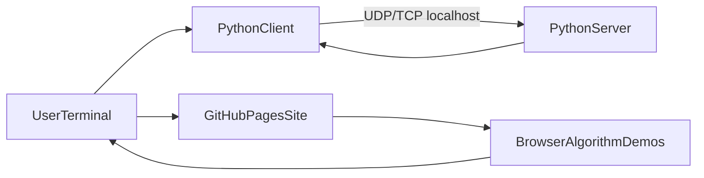

# Architecture Overview

## Design Principles

- Keep networking behavior authentic in Python socket modules.
- Keep GitHub Pages browser-native and algorithm focused.
- Provide one-click discoverability from root README and site landing.
